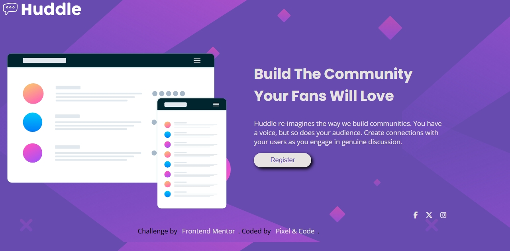

# Frontend Mentor - Huddle landing page with single introductory section solution

This is a solution to the [Huddle landing page with single introductory section challenge on Frontend Mentor](https://www.frontendmentor.io/challenges/huddle-landing-page-with-a-single-introductory-section-B_2Wvxgi0). Frontend Mentor challenges help you improve your coding skills by building realistic projects. 

## Table of contents

- [Overview](#overview)
  - [The challenge](#the-challenge)
  - [Screenshot](#screenshot)
  - [Links](#links)
- [My process](#my-process)
  - [Built with](#built-with)
  - [What I learned](#what-i-learned)
  - [Continued development](#continued-development)
  - [Useful resources](#useful-resources)
- [Author](#author)
- [Acknowledgments](#acknowledgments)

**Note: Delete this note and update the table of contents based on what sections you keep.**

## Overview

I built a responsive landing page for Huddle, a community-focused platform that encourages user engagement and interaction. The page aims to capture attention with its bold colors, friendly visuals, and clear call to action.

- A clean and modern landing page showcasing an inviting hero section, descriptive text, and an eye-catching mockup illustration.

- A register button that triggers a friendly JavaScript alert to simulate user interaction.

- Social media icons with hover states to encourage users to connect on different platforms.

- Responsive layout using flexbox, ensuring good display on large screens (desktop-first).

### The challenge

I didn’t face major challenges on this build — the structure was straightforward, and working with flexbox and background images felt natural thanks to prior practice.

### Screenshot




### Links

- Solution URL: [GitHub repo](https://github.com/jeff20501/Huddle-landing-page)
- Live Site URL: [netlify url](https://hupage.netlify.app/)

## My process

- Started by structuring the page in HTML with clearly separated sections (header, hero, info, social links, footer).

- Styled the page using CSS with flexbox for easy horizontal layout and good spacing between elements.

- Used background images and color overlays to achieve the vibrant purple theme.

- Integrated Font Awesome icons to easily display social links with smooth hover effects.

- Added a small JavaScript snippet to handle button click feedback for better user experience.

### Built with

- HTML5 — semantic structure and accessibility considerations

- CSS3 — flexbox layout, background images, custom button styles, hover effects

- Font Awesome — for scalable and accessible social media icons

- JavaScript (Vanilla) — for handling user interaction on the register button

### What I learned

Use this section to recap over some of your major learnings while working through this project. Writing these out and providing code samples of areas you want to highlight is a great way to reinforce your own knowledge.

To see how you can add code snippets, see below:

```html
<h1>Some HTML code I'm proud of</h1>
```
```css
.proud-of-this-css {
  color: papayawhip;
}
```
```js
const proudOfThisFunc = () => {
  console.log('🎉')
}
```


## Author

- Frontend Mentor - [jeff20501](https://www.frontendmentor.io/profile/jeff20501)
- Github - [jeff20501](https://github.com/jeff20501)

